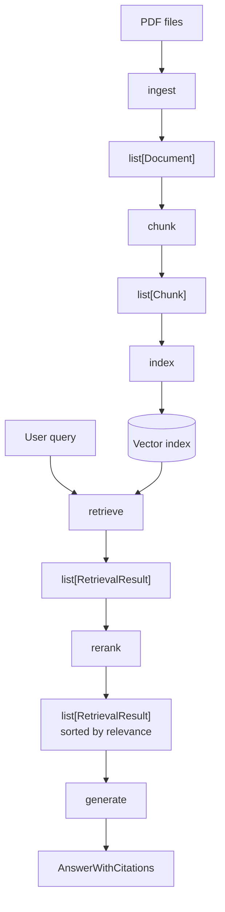
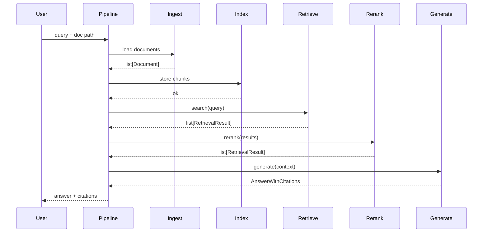

# Architecture

## System Overview

doc-grounded-rag is a modular RAG pipeline that answers questions
grounded strictly in a corpus of PDF documents.

## Pipeline Stages

## Module Responsibilities

### contracts
Typed data models shared across all modules.
No logic. No I/O. Pure dataclasses or Pydantic models.
- Document: source_file, pages, raw text
- Chunk: doc_id, source_file, page, chunk_id, text
- RetrievalResult: chunk, score, retrieval_method
- AnswerWithCitations: answer_text, citations[]

### config
Loads and validates settings from environment variables.
Raises an explicit error at startup if required config is missing.

### logging
Structured logger (JSON-compatible).
Base exception hierarchy for pipeline stages.
All stage errors are stage-aware.

### ingest
Locates PDF files, extracts text, attaches page-level metadata.
Returns a list of Document objects.
Does not chunk, embed, or store.

### chunk
Splits a Document into fixed-size overlapping text segments.
Attaches metadata from the parent Document to every Chunk.
- Takes: list[Document]
- Returns: list[Chunk]
- Does not embed, store, or retrieve.
- Output is deterministic for the same input and config.

### index
Receives Chunk objects, generates embeddings, stores in index.
Is a write-only operation at pipeline time.

### retrieve
Given a query string, searches the index using semantic and keyword methods.
Returns a list of RetrievalResult objects with scores.

### rerank
Given a list of RetrievalResult objects, applies cross-encoder scoring.
Returns a reordered list.

### generate
Given a list of RetrievalResult objects as context, calls the LLM.
Must only use provided context. Returns AnswerWithCitations.
If context is insufficient, returns a no-evidence response.

### eval
Runs a fixed evaluation dataset through retrieve + generate.
Measures Precision@k, Recall@k, faithfulness, citation accuracy.

### pipeline
Orchestrates all stages in sequence.
Logs stage start, finish, and duration.
Surfaces stage-specific errors.

## Dependency Rules
- contracts: no dependencies
- config: no dependencies
- logging: no dependencies
- ingest → contracts
- chunk → contracts
- index → contracts
- retrieve → contracts
- rerank → contracts
- generate → contracts
- eval → contracts, retrieve, generate
- pipeline → ingest, index, retrieve, rerank, generate, eval
No circular dependencies permitted.

## v1 Constraints
- PDF input only
- Single-domain corpus
- No external APIs (local models only)
- No OCR (text-based PDFs only)
- No streaming responses
- No multi-turn conversation

## Non-Goals (v1)
- Multi-format ingestion (Word, HTML, etc.)
- Real-time document updates
- Multi-tenant isolation
- Streaming generation
- Web UI

## Sequence Diagram (end-to-end query)

